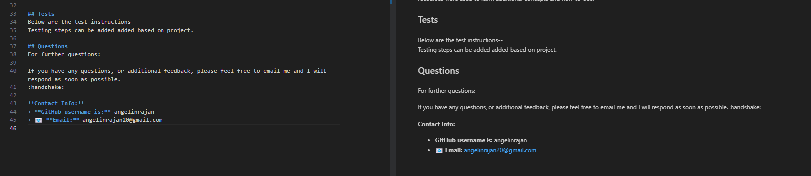

## Angelin_Professional-Readme-Generator

## Purpose
The purpose of this application is to help developers save time by generating a professional readme.md file for their projects. The user is prompted with a series of questions and choices, and their responses are automatically logged within the generated readme.md file with the correct formats and links, including a table of contents.

## Live Demo & Screenshots of readme -
This application is not deployed as a live website. It is a tool to be used locally.    
**Link to live demo:**    <video src="Angelin_ProfessionalReadmeGenerator.mp4" controls title="Demo"></video>
_May need to download the mp4 video to enable audio from the assets folder._

**Screenshots:** 

## Functionality of the website-
After installing the application locally, you can run it using the command node index.js. This will present you with a series of prompts that you need to answer. The application will then populate your responses under their corresponding headers in the generated readme.md file. The following prompts are presented to the user:
* What is your project title?
* What is your Project description?
* What is/are the name of the License(s) used within your project?
* Enter installation instructions
* Enter usage information for your project
* Enter contribution guidelines
* Enter test instructions
* Enter your GitHub username
* Enter your email address
The prompt for the license provides users with choices to select from. After all 9 prompts are answered, a professional readme.md file is generated along with a table of contents. The generated readme.md file displays a badge at the top, indicating the selected license name. All user responses are organized within their appropriate sections, ensuring clear readability.

## Creation steps-
Created a new repository within Github (included README file - current file for project functionality)
Copied the ssh url for cloning
Performed a git clone command followed by the copied ssh url in my local (VS code)
Starter files were copied over to the project
Inquirer was installed using the npm i inquirer command in the terminal
Validated that node_modules files are under .gitignore
Multiple commits and git push was done to keep repository up to date
Progress was checked multiple times by running node index.js in the terminal
Final commit and push was performed to add codes to github

## Outside source reference:
To learn abouot badge: https://shields.io/badges 
To earn about prompt: https://www.npmjs.com/package/prompts
Professional readme documentation: https://coding-boot-camp.github.io/full-stack/github/professional-readme-guide
licence information: https://choosealicense.com/
Tutor session
Write file to specific location: https://stackoverflow.com/questions/54321161/how-to-write-a-file-to-specific-directory-in-nodejs
Learn about axios: https://www.google.com/search?q=what+is+axios+in+node+js&rlz=1C1QMKX_enUS1055US1056&oq=what+is+axios+in+node+js&aqs=chrome..69i57j0i22i30j0i390i650l2.206026199j0j15&sourceid=chrome&ie=UTF-8